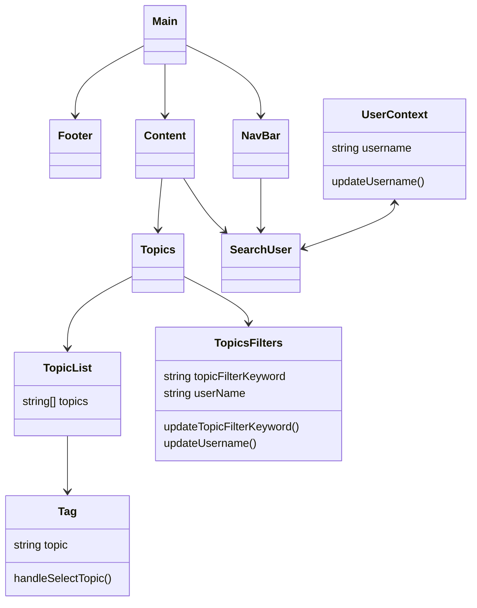

```mermaid
classDiagram
Main --> NavBar
Main --> Content
Main --> Footer
NavBar --> SearchUser
Content --> SearchUser
UserContext <--> SearchUser
UserContext : string username
UserContext : updateUsername()
Content --> Topics
Topics --> TopicsFilters
TopicsFilters : string topicFilterKeyword
TopicsFilters : string userName
TopicsFilters : updateTopicFilterKeyword()
TopicsFilters : updateUsername()
Topics --> TopicList
TopicList : string[] topics
TopicList --> Tag
Tag: string topic
Tag: handleSelectTopic()
```
